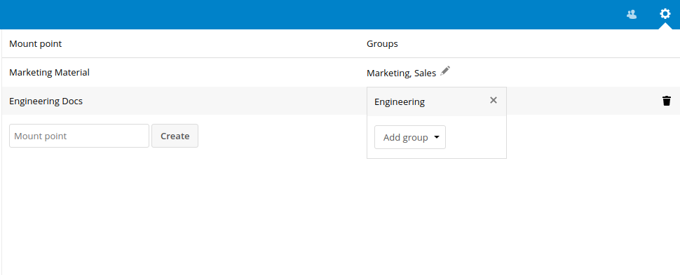
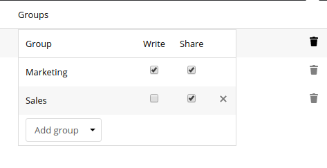
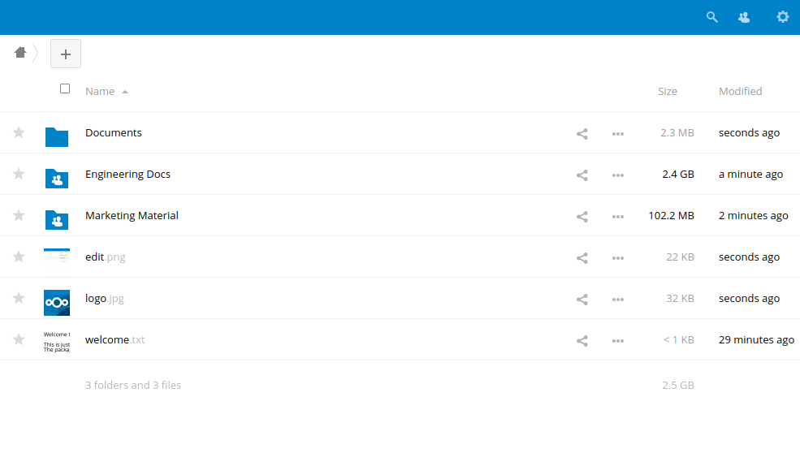
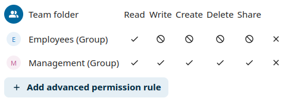
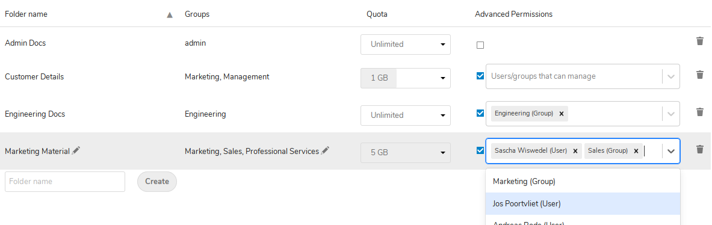

<!--
  - SPDX-FileCopyrightText: 2017 Nextcloud GmbH and Nextcloud contributors
  - SPDX-License-Identifier: AGPL-3.0-or-later
-->
# Group Folders

[](https://api.reuse.software/info/github.com/nextcloud/groupfolders)

📁👩‍👩‍👧‍👦 Admin configured folders accessible by everyone in a group in Nextcloud.

## References

* **[Known issues and FAQs](https://github.com/nextcloud/groupfolders/issues/1414)**
* **[Release Notes](https://github.com/nextcloud-releases/groupfolders/releases)[^1]**
* **[App Store](https://apps.nextcloud.com/apps/groupfolders)**

[^1]: The releases are now managed in a [dedicated release repository](https://github.com/nextcloud-releases/groupfolders/releases). The releases in this repository may be outdated.

## Configuring Group Folders

Group Folders can be configured through *Group Folders* under *Administration settings*.

After a folder is created, the admin can give access to the folder to one or more groups, a quota can be assigned for the folder and advanced permissions can be activated and configured.




Permissions to the content of a group folder can be configured on a per-group basis.



The configuration options include the _Write_, _Share_ and _Delete_ permissions for each group.

## Using Group Folders

Once configured, the folders will show up in the home folder for each user in the configured groups.



## Setting Advanced Permissions

_Advanced Permissions_ allows entitled users to configure permissions inside groupfolders on a per file and folder basis.

Permissions are configured by setting one or more of "Read", "Write", "Create", "Delete" or "Share" permissions to "allow" or "deny". Any permission not explicitly set will inherit the permissions from the parent folder. If multiple configured advanced permissions for a single file or folder apply for a single user (such as when a user belongs to multiple groups), the "allow" permission will overwrite any "deny" permission. Denied permissions configured for the group folder itself cannot be overwritten to "allow" permissions by the advanced permission rules.



Users or whole groups can be entitled to set advanced permissions for each group folder separately on the group folders admin page.
For entitlements, only users from those groups are selectable which have to be configured selected in the Groups column.



## Configuration parameters

Some settings are currently only exposed via `config/config.php`:

### Default quota for new groupfolders

```injectablephp
'groupfolders.quota.default' => -3,
```

The special value `-3` means unlimited and any other value is the quota limit in bytes.

## Command-line interface management and configuration (via `occ`)

Group folders can be configured and managed from the command-line interface (CLI). This is accomplished by using the `occ` command. 

The `occ` command is utilized throughout Nextcloud for many operations and is not specific to Group Folders. When the Group Folders app is enabled, the `occ` command gains additional functionality specific to Group Folders.

If you're unfamiliar with `occ` see [Using the occ command](https://docs.nextcloud.com/server/latest/admin_manual/configuration_server/occ_command.html) in the Nextcloud Server Administration Guide for general guidance.

### Commands Available

- `occ groupfolders:create <name>` &rarr; create a group folder
- `occ groupfolders:delete <folder_id> [-f|--force]` &rarr; delete a group folder and all its contents
- `occ groupfolders:expire` &rarr; trigger file version and trashbin expiration (see [Nextcloud docs for versioning](https://docs.nextcloud.com/server/latest/admin_manual/configuration_files/file_versioning.html) and [Nextcloud docs for the trash bin](https://docs.nextcloud.com/server/latest/admin_manual/configuration_files/trashbin_configuration.html) for details)
- `occ groupfolders:group <folder_id> <group_id> [-d|--delete] [write|share|delete]` &rarr; assign groups and their rights to a group folder
- `occ groupfolders:list` &rarr; list configured group folders
- `occ groupfolders:permissions` &rarr; configure advanced permissions (see below for details)
- `occ groupfolders:quota <folder_id> [<quota>|unlimited]` &rarr; set a quota for a group folder
- `occ groupfolders:rename <folder_id> <name>` &rarr; rename a group folder
- `occ groupfolders:scan <folder_id>` &rarr; trigger a filescan for a group folder
- `occ groupfolders:trashbin:cleanup` &rarr; empty the trashbin of all group folders
- `occ config:app:set groupfolders enable_encryption --value="true"` &rarr; activate encryption (server-side) support

### Configuring Advanced Permissions via `occ`

Advanced permissions can also be configured through the `occ groupfolders:permissions` command, but must be enabled first.

#### Enabling

Before configuring any advanced permissions you'll first have to enable advanced permissions for the folder using `occ groupfolders:permissions <folder_id> --enable`. To do this you'll first need to find the `folder_id` of the groupfolder you're trying to configure. You can use `occ groupfolders:list` to find the `folder_id` of the target folder.

#### Using

Then you can list all configured permissions trough `occ groupfolders:permissions <folder_id>`.

```
occ groupfolders:permissions 1
+------------+--------------+-------------+
| Path       | User/Group   | Permissions |
+------------+--------------+-------------+
| folder     | group: admin | +write      |
| folder/sub | user: admin  | +share      |
|            | user: test   | -share      |
+------------+--------------+-------------+
```

Permissions for files and folders can be set trough `occ groupfolders:permissions <folder_id> --group <group_id> <path> -- <permissions>` to set permissions for a group or `occ groupfolders:permissions <folder_id> --user <user_id> <path> -- <permissions>` to set permissions for a single user.

`<permissions>` can be one or more of the following options: `-read`, `+read`, `-write`, `+write`, `-create`, `+create`, `-delete`, `+delete`, `-share` or `+share` to set the set the respective permission to "deny" or "allow".
You can delete a rule by passing `clear` as the `<permissions>` field.
Note: An advanced permission settings set always needs to be complete (for example `+read -create +delete`) and not just incremental (for example `-create`).
Not mentioned options (in the above example that's _write_ and _share_) are interpreted as _inherited_.

To help with configuring nested permission rules, you can check the effective permissions a user has for a path using `occ groupfolders:permissions <folder_id> --user <user_id> <path> --test`.

To manage the users or groups entitled to set advanced permissions, use `occ groupfolders:permissions <folder_id> [[-m|--manage-add] | [-r|--manage-remove]] [[-u|--user <user_id>] | [-g|--group <group_id>]]`.

#### Disabling

To disable the advanced permissions feature for a group folder, use `occ groupfolders:permissions <folder_id> --disable`.

## APIs

### REST API

See the [OpenAPI specification](openapi.json) to learn about all available API endpoints: https://petstore.swagger.io/?url=https://raw.githubusercontent.com/nextcloud/groupfolders/master/openapi.json

### WebDAV API

Group folders are also exposed through a separate [WebDAV API](https://docs.nextcloud.com/server/latest/user_manual/en/files/access_webdav.html) at `/remote.php/dav/groupfolders/<user id>`.

In addition to browsing the contents of the group folders, you can also request the mount point for the group folder by requesting the `{http://nextcloud.org/ns}mount-point` property.

